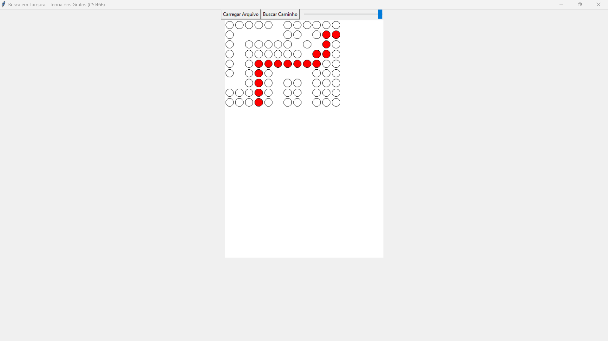

# Trabalho Prático 01 - Teoria dos Grafos

Trabalho Prático feito em Python que visa utilizar a Busca em Largura para encontrar o menor caminho a ser percorrido em um grafo a partir de uma imagem .BMP.

Foi utilizada as bibliotecas TKinter e PIL para manipulação da imagem e criação da interface!

    <h3>Language:</h3>
    

# Final Result 🔥 

 

## Starting 

Para usar o projeto, siga os passos abaixo:
1. Faça o download de todos arquivos neste repositório;
2. Instale o python na sua máquina;
3. Execute o arquivo main.py na sua IDE;
4. Clique em "carregar imagem" e selecione seu arquivo .BMP;
5. Após isso clique em "Buscar Caminho";
6. Utilize o zoom caso necessário!

--- 

##### Make with 🧠 by Matheus Lopes.