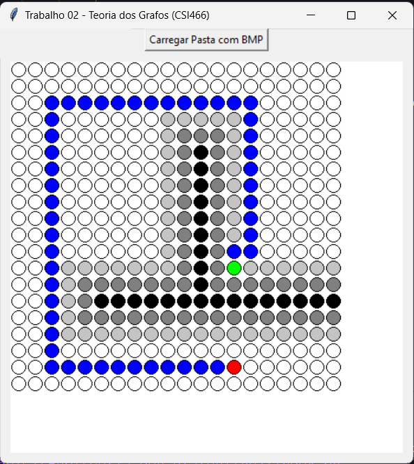

# Trabalho Prático 02 - Teoria dos Grafos

    <h3>Language:</h3>
    

# Final Result 🔥 

 

## Starting 

Para usar o projeto, siga os passos abaixo:
1. Faça o download de todos arquivos neste repositório;
2. Instale o python na sua máquina;
3. Execute o arquivo index.py na sua IDE;
4. Clique em "carregar" e selecione sua pasta com os arquivos .BMP;

--- 

##### Make with 🧠 by Matheus Lopes.